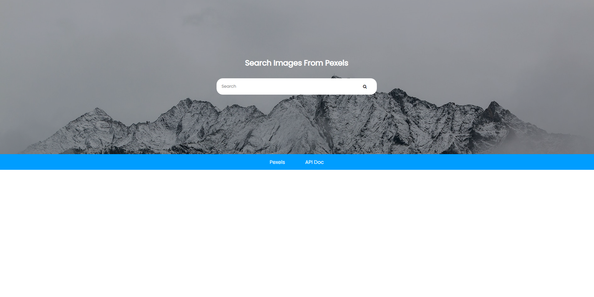
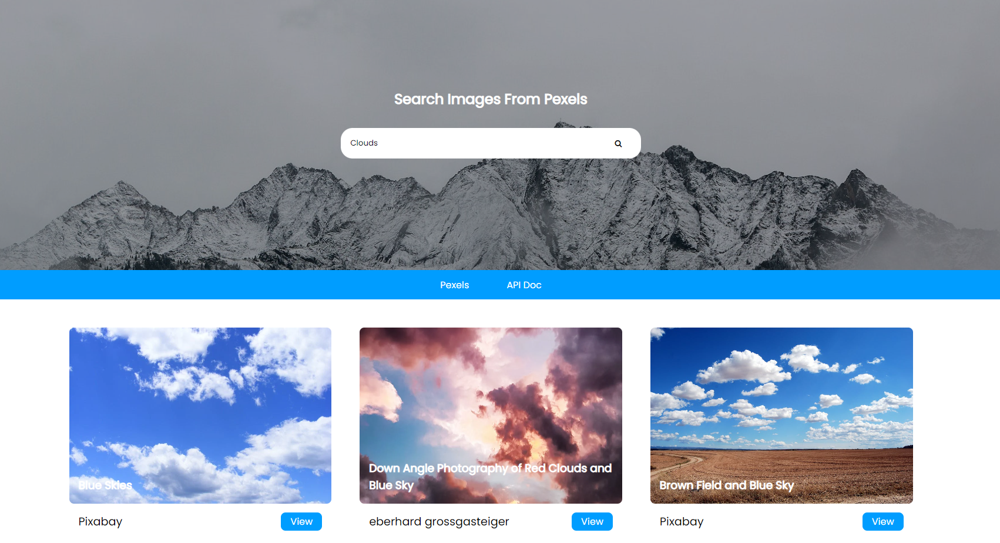
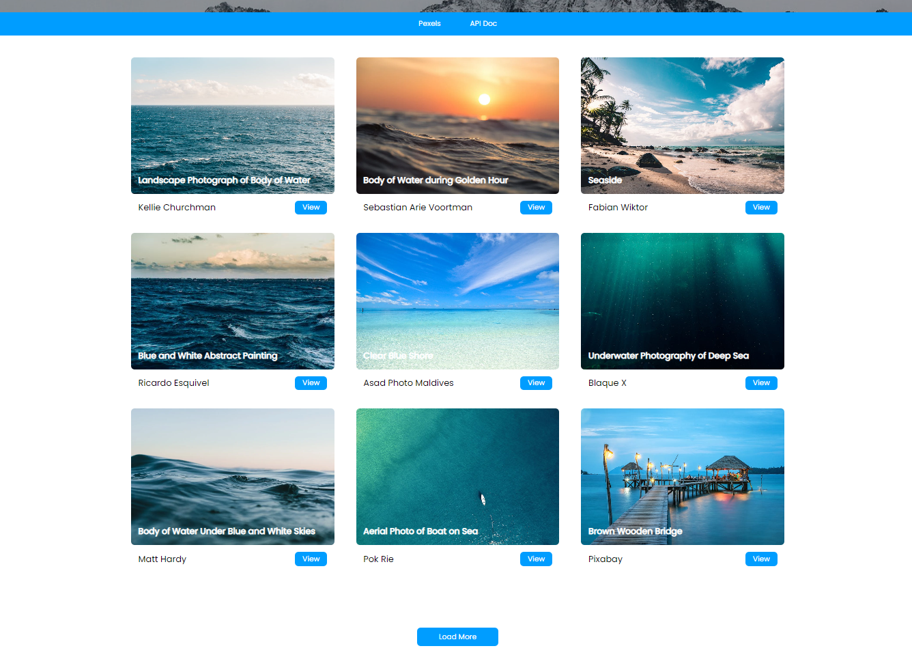
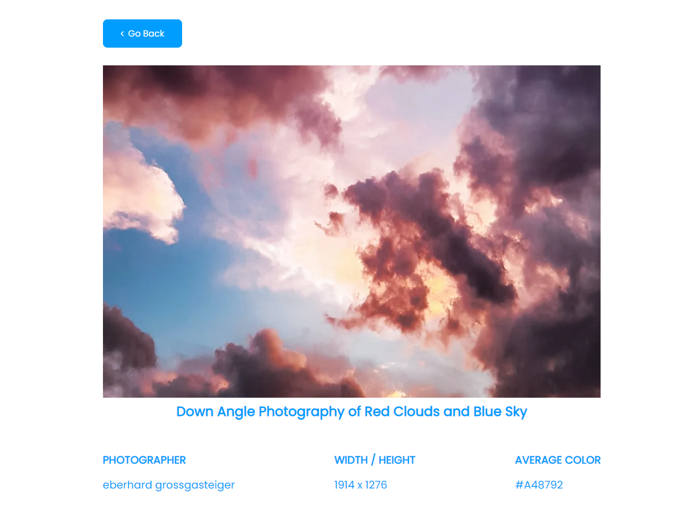

# Gallery made using Pexels API.

Project that uses Fetch API to pull data from Pexels.com

Functions
1. Fetch and display photos from Pexels API
3. Search photos by using search query.
2. Load more photos using load more function
4. View individual photos for more information

This project folder does not contain pexels API key. You can get key from [pexles.com]https://www.pexels.com/api/ in a minute by signing in.
For testing this project add API key to app.js file as variable "key".

- ### Normal View

-### Search results view

-### Gallery grid and load more button

-### individual photo view after clicking view button

